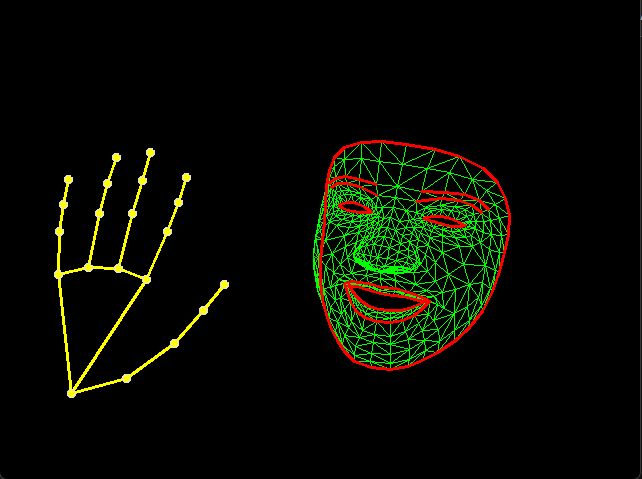

# 🤖 Neon Mesh Avatar (Face + Hands)

<div align="center">
  <a href="#-english">🇺🇸 <strong>English</strong></a> | 
  <a href="#-türkçe">🇹🇷 <strong>Türkçe</strong></a>
</div>

<div align="center">
  
  <br>
</div>

---

<a name="-english"></a>
## 🇺🇸 English

**Neon Mesh Avatar** is a computer vision application that transforms you into a digital entity. Using **Google MediaPipe Holistic**, it tracks your face mesh (468 points) and hand skeletons (21 points per hand) in real-time, rendering them as a glowing neon wireframe.

The processed video is streamed directly to a **Virtual Camera driver**, allowing you to use this "Neon Mesh Avatar" in meetings on **Zoom, Discord, Google Meet, or Microsoft Teams**.

### 🌟 Key Features
* **Full Holistic Tracking:** Simultaneously tracks face landmarks, irises, and both hands with high precision.
* **Virtual Camera Output:** Acts as a webcam device. No need for screen sharing; just select it as your camera in any app.
* **Cyberpunk Aesthetic:** Features a high-contrast "Matrix Green" and "Neon Yellow" wireframe style on a pitch-black background.
* **Privacy Mode:** Completely hides your real environment and face, showing only the digital reconstruction.

### 🛠️ Tech Stack
* **Python 3.x**
* **MediaPipe Holistic:** For unified topology tracking.
* **OpenCV:** For drawing and image processing.
* **pyvirtualcam:** For streaming frames to the OS camera driver.

### ⚙️ Installation

1.  **Prerequisite:** Install **OBS Studio** (or just the OBS Virtual Cam driver) to enable virtual camera support on your OS.

2.  **Clone the repository:**
    ```bash
    git clone [https://github.com/emreefeyuksel/Cyberpunk-Hologram-Cam.git](https://github.com/emreefeyuksel/Cyberpunk-Hologram-Cam.git)
    cd Cyberpunk-Hologram-Cam
    ```

3.  **Install dependencies:**
    ```bash
    pip install opencv-python mediapipe numpy pyvirtualcam
    ```

### 🎮 Usage

1.  Run the script:
    ```bash
    python main.py
    ```
2.  A preview window named **"Cyberpunk Avatar Preview"** will appear.
3.  Open your target application (e.g., **Discord**).
4.  Go to **Video Settings** and select **"OBS Virtual Camera"** as your input device.
5.  Raise your hands and enjoy your new digital look!

* **'q':** Quit the application.

---

<a name="-türkçe"></a>
## 🇹🇷 Türkçe

**Neon Mesh Avatar**, sizi dijital bir varlığa dönüştüren bir bilgisayarlı görü uygulamasıdır. **Google MediaPipe Holistic** modelini kullanarak yüz ağınızı (468 nokta) ve el iskeletlerinizi (her el için 21 nokta) gerçek zamanlı takip eder ve bunları parlayan bir neon tel kafes (wireframe) olarak çizer.

İşlenen görüntü doğrudan **Sanal Kamera sürücüsüne** aktarılır. Bu sayede **Zoom, Discord, Google Meet veya Microsoft Teams** gibi uygulamalarda bu "Neon Mesh Avatarı"nı kendi kameranız olarak kullanabilirsiniz.

### 🌟 Temel Özellikler
* **Tam Bütüncül Takip (Holistic):** Yüz hatlarını, göz bebeklerini ve her iki eli aynı anda yüksek hassasiyetle takip eder.
* **Sanal Kamera Çıkışı:** İşletim sisteminde bir webcam gibi davranır. Ekran paylaşmaya gerek kalmadan kamera ayarlarından seçilebilir.
* **Cyberpunk Estetiği:** Simsiyah bir arka plan üzerinde "Matrix Yeşili" ve "Neon Sarısı" çizgilerle fütüristik bir görünüm sunar.
* **Gizlilik Modu:** Gerçek yüzünüzü ve odanızı tamamen gizler, sadece dijital rekonstrüksiyonu gösterir.

### 🛠️ Kullanılan Teknolojiler
* **Python 3.x**
* **MediaPipe Holistic:** Birleşik topoloji takibi için.
* **OpenCV:** Çizim ve görüntü işleme işlemleri için.
* **pyvirtualcam:** Görüntüyü işletim sistemi kamera sürücüsüne göndermek için.

### ⚙️ Kurulum

1.  **Ön Hazırlık:** Bilgisayarınızda sanal kamera desteği için **OBS Studio**'nun (veya sadece OBS Virtual Cam sürücüsünün) kurulu olması gerekir.

2.  **Projeyi indirin:**
    ```bash
    git clone [https://github.com/emreefeyuksel/Cyberpunk-Hologram-Cam.git](https://github.com/emreefeyuksel/Cyberpunk-Hologram-Cam.git)
    cd Cyberpunk-Hologram-Cam
    ```

3.  **Gerekli kütüphaneleri yükleyin:**
    ```bash
    pip install opencv-python mediapipe numpy pyvirtualcam
    ```

### 🎮 Kullanım

1.  Uygulamayı başlatın:
    ```bash
    python main.py
    ```
2.  Ekranda **"Cyberpunk Avatar Preview"** penceresi açılacaktır.
3.  Kullanmak istediğiniz uygulamayı (örn. **Discord**) açın.
4.  **Video Ayarları**'na gidin ve kamera kaynağı olarak **"OBS Virtual Camera"**yı seçin.
5.  Ellerinizi kaldırın ve yeni dijital görünümünüzün tadını çıkarın!

* **'q':** Çıkış yapmak için basın.

---
<div align="center">
  Developed by <a href="https://github.com/emreefeyuksel">Emre Efe Yüksel</a>
</div>
